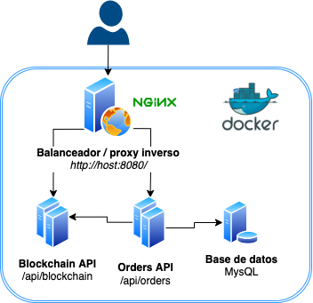

# 📶 Monitorizando: Docker, API's en Java + base de datos con Dynatrace

Este repositorio incluye 2 API's:

- una primera que simula unas operaciones de verificación de una cadena de bloques (`/api/blockchain/`)
- otra que simula operaciones de pedidos (`/api/orders/`) de clientes. Esta aplicación además, se conecta con una base de datos **MySQL** para registrar tales pedidos y con otra API para realizar alguna que otra validación previa.

Se incluye además un balanceador de carga y proxy inverso **nginx** través del cual se puede acceder a las diferentes API's y que, a modo de ejemplo, permitiría escalar los servicios arriba/abajo atendiendo a la carga asociada. Este balanceador de carga expone sus servicios a través del puerto `8080`.



## Requisitos

Para ejecutar todos los servicios correctamente es necesario disponer de [Docker Engine](https://docs.docker.com/engine/) y
de [docker-compose](https://docs.docker.com/compose/) instalados. Una opción sencilla es
instalar [Docker Desktop](https://docs.docker.com/desktop/) que además de otros componentes incluye a éstos de serie.

## Arrancando

Una vez instalados los requisitos, puedes clonar este repositorio en tu máquina de destino:

`git clone ...`

A continuación ejecutar todos los servicios con el comando:

`docker-compose up -d`

Es posible que este comando te lleve algo de tiempo en que acabe de responder, sobretodo la primera vez. Puedes comprobar que todos los servicios estén operativos y sanos a través del comando:

`docker-compose ps`

Deberíamos obtener un resultado similar a este:

```
NAME                         COMMAND                  SERVICE             STATUS              PORTS
monitoring-dt-blockchain-1   "jbang BlockChainSer…"   blockchain          running (healthy)   80/tcp
monitoring-dt-db-1           "docker-entrypoint.s…"   db                  running (healthy)   0.0.0.0:3306->3306/tcp
monitoring-dt-orders-1       "jbang OrdersService…"   orders              running (healthy)   80/tcp
monitoring-dt-webproxy-1     "/app/docker-entrypo…"   webproxy            running             0.0.0.0:8080->80/tcp
```

### API de cadena de bloques

Una vez todos los servicios estén activos y sanos, puedes conectar a través de las diferentes API's a través del balanceador de carga. 

Respecto a la primera API, que emula un servicio de cálculo de una cadena de bloques (_BlockChain_), podemos comprobar que funciona, realizando las siguientes llamadas:

```
# curl -d '{ "number": {numero} }' --header 'Content-Type: application/json' http://localhost:8080/api/blockchain/

curl -d '{ "number": 10 }' --header 'Content-Type: application/json' http://localhost:8080/api/blockchain/
22
curl -d '{ "number": 11221 }' --header 'Content-Type: application/json' http://localhost:8080/api/blockchain/
169
```
Este tipo de peticiones POST requieren incluir en la petición con un objeto JSON un número (`number`) a partir del cual se inicia el cálculo de la cadena de bloques. El servidor devolverá como respuesta devuelve el tiempo que ha tardado el servidor en procesar tal número en milisegundos. 

**Nota**: ¡presta atención al número que envíes! ¡Cuánto más grande lo envíes, más tiempo llevará al servidor procesar tal número 😅!

También podemos realizar una petición a un endpoint que actúa simulando lo que sería un resumen de la cadena de bloques:
```
curl http://localhost:8080/api/blockchain/summary
{ "requests": 4, "latency": 5829 }
```
El servidor devuelve como respuesta un objeto JSON con el contador del número de peticiones realizadas y la latencia media para tal endpoint.

### API de gestión de pedidos

Respecto a la otra API, la que simula un servicio de gestión de pedidos de clientes (_Orders_), puedes comprobar que está activa y funcionando a través de las llamadas siguientes:
```
curl http://localhost:8080/api/orders/health
{}
```

También podemos probar a realizar otra petición, para crear un nuevo pedido en nuestra base de datos, accediendo además a otra API:
```
#curl -d '{ "id": {numero} }' --header 'Content-Type: application/json' http://localhost:8080/api/orders/purchase

curl -d '{ "id": 1234 }' --header 'Content-Type: application/json' http://localhost:8080/api/orders/purchase
222
curl -d '{ "id": 20230 }' --header 'Content-Type: application/json' http://localhost:8080/api/orders/purchase
441
```

Este tipo de peticiones POST requieren incluir en la petición un objeto JSON un número (`id`) a partir del cual se realizan una serie de validaciones. A partir de este momento, esta API contacta con otros servicios y API's para finalmente almacenar tal pedido en nuestra base de datos. Como respuesta, el servidor devolverá el tiempo que ha tardado en procesar tal pedido en milisegundos.

**Nota**: ¡presta atención al número que envíes como identificador de pedido! ¡Cuánto más grande lo envíes, más tiempo llevará al servidor procesar tal número de pedido 😅!
